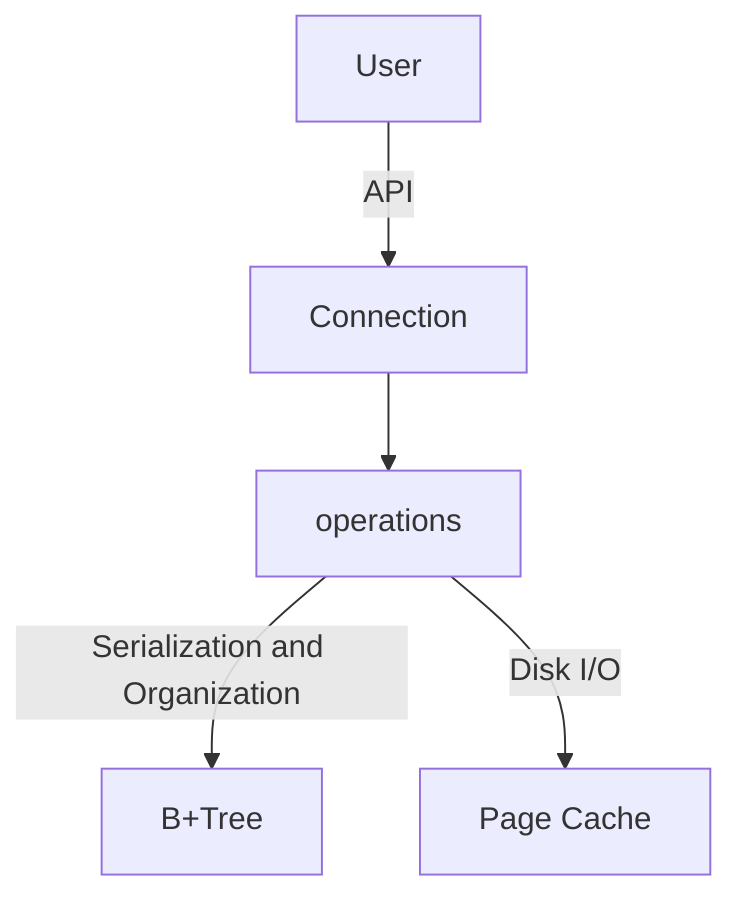

# tinystore

> [!NOTE]
> In early stages of development, the goal is a:

Simple, distributed key value storage engine.
Current architecture consists of a page cache, b+tree and application connection object.  

