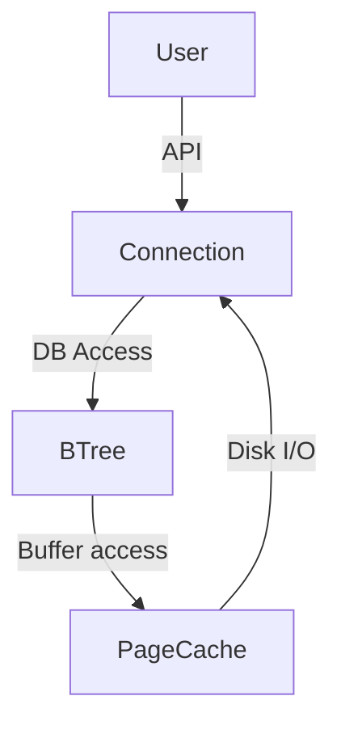

# tinystore

- Inspired by [yakv](https://github.com/knizhnik/yakv)

> [!NOTE]
> In early stages of development, the goal is a:

Simple, distributed key value storage engine.
Current target architecture consists of a page cache, b+tree and application connection object.  

### Rough Benchmarks (I know, it's slow)
- Randomly generated 10 byte keys, 6 byte values

| # of entries | Time (ms) | Insertion kb/s | Retrieval kb/s |
| ------------ | --------- | -------------- | -------------- |
| 10,0000      | 1,255     | 177            | 455            |
| 100,00       | 16,721    | 142            | 292            |
| 500,000      | 83,342    | 139            | 308            |

## Goals
- [ ] Stop randomly losing records!
- [ ] Write Ahead Logging
- [ ] LRU Page Caching
- [ ] HTTP Interface
- [ ] Multi-Threading
- [ ] ACID Compliance?
- [ ] Distributed Network?

